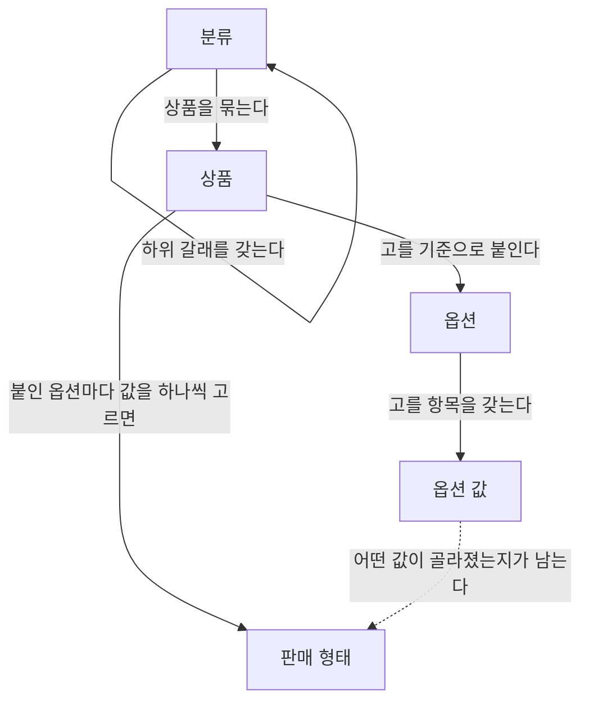

# 용어

> 명세가 쓰는 제품 용어와 개념 사이의 관계. 명세 문서들은 여기서 정한 말로만 쓴다.
>
> 이 말들이 코드에서 어떤 이름을 갖는지는 여기에 적지 않는다.

---

## 개념

| 용어 | 뜻 |
| --- | --- |
| 상품 | 파는 대상 하나를 가리키는 단위. 고객이 "이것 하나"로 인지하는 것 |
| 판매 형태 | 한 상품 안에서 실제로 골라 사게 되는 하나의 형태. 옵션마다 값을 하나씩 고르면 정해진다 |
| 분류 | 상품을 묶는 갈래. 갈래 안에 갈래가 들어가는 나무 모양이다 |
| 옵션 | 고객이 무엇을 기준으로 고르는지를 나타내는 선택지의 종류 |
| 옵션 값 | 한 옵션 안에서 고를 수 있는 항목 |

옵션과 옵션 값은 상품보다 먼저 존재한다. 여러 상품이 같은 옵션을 가져다 쓴다.

## 개념 사이의 관계

## 상태

| 용어 | 뜻 |
| --- | --- |
| 보관 | 더 이상 쓰지 않기로 했지만 아직 없애지 않은 상태 |
| 파기 | 없앤 상태 |

보관과 파기는 상품·분류·옵션에 모두 있다. 무엇을 없앨 때 어떤 순서를 밟아야 하는지는 그 업무를 다루는 명세가 소유한다.

## 표기

| 용어 | 뜻 |
| --- | --- |
| 이름 | 사람에게 보여 주는 말. 바뀔 수 있다 |
| 핸들 | 대상을 가리키기 위해 운영자가 정하는 짧은 표기 |
| 분류 경로 | 뿌리 갈래에서 그 분류까지의 이름을 차례로 이어 붙인 표기 |
