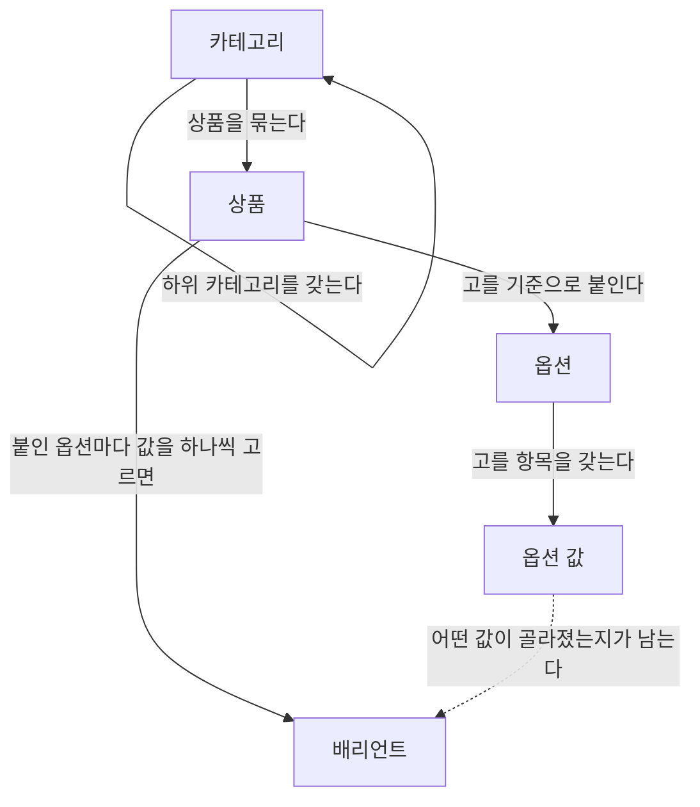

# 용어

> 명세가 쓰는 제품 용어와 개념 사이의 관계. 명세 문서들은 여기서 정한 말로만 쓰고, 회의와 코드도 같은 말을 쓴다.
>
> 이 말들이 코드에서 어떤 이름을 갖는지는 여기에 적지 않는다.

---

## 개념

| 용어 | 뜻 |
| --- | --- |
| 상품 | 파는 대상 하나. 고객이 "이것 하나"로 인지하는 것 |
| 배리언트 | 한 상품 안에서 고객이 실제로 골라 사게 되는 하나. 붙어 있는 옵션마다 값을 하나씩 고르면 정해진다 |
| 카테고리 | 상품을 묶는 분류. 카테고리 안에 카테고리가 들어가는 트리 구조다 |
| 옵션 | 고객이 무엇을 기준으로 고르는지를 나타내는 선택지의 종류 |
| 옵션 값 | 한 옵션 안에서 고를 수 있는 항목 |

옵션과 옵션 값은 상품보다 먼저 존재한다. 여러 상품이 같은 옵션을 가져다 쓴다.

## 개념 사이의 관계



## 채워진 모습

```
상품        기본 티셔츠                    핸들  basic-tee
카테고리    의류 > 상의 > 티셔츠           ← 이 한 줄이 카테고리 경로
옵션        1) 색   2) 사이즈

배리언트    검정 / M                       핸들  basic-tee-black-m
            검정 / L                       핸들  basic-tee-black-l
            흰색 / M                       핸들  basic-tee-white-m
```

"색"과 "사이즈"가 **옵션**이고, "검정"과 "M"이 그 안의 **옵션 값**이다. 옵션마다 값을 하나씩 고른 결과가 **배리언트** 하나다. 조합이 여섯 가지여도 실제로 파는 셋만 존재할 수 있다.

## 상태

| 용어 | 뜻 |
| --- | --- |
| 보관 | 더 이상 쓰지 않기로 했지만 아직 없애지 않은 상태. 되돌릴 수 있다 |
| 삭제 | 없앤 상태. 되돌릴 수 없다 |

보관과 삭제는 상품·카테고리·옵션에 모두 있다. 어떤 순서를 밟아야 하는지는 [정리](./retirement.md)가 소유한다.

## 표기

| 용어 | 뜻 |
| --- | --- |
| 이름 | 사람에게 보여 주는 말. 겹쳐도 되고 언제든 바뀔 수 있다 |
| 핸들 | 대상을 주소처럼 가리키려고 운영자가 정하는 짧은 표기. 이름과 달리 겹치지 않아야 한다 |
| 카테고리 경로 | 최상위 카테고리부터 그 카테고리까지의 이름을 차례로 이어 붙인 한 줄 표기 |

카테고리 경로는 그 카테고리가 **어디에 속한 무엇인지**를 한 줄로 읽게 해 준다. 이름만으로는 "티셔츠"가 의류 밑인지 아동복 밑인지 알 수 없다.
