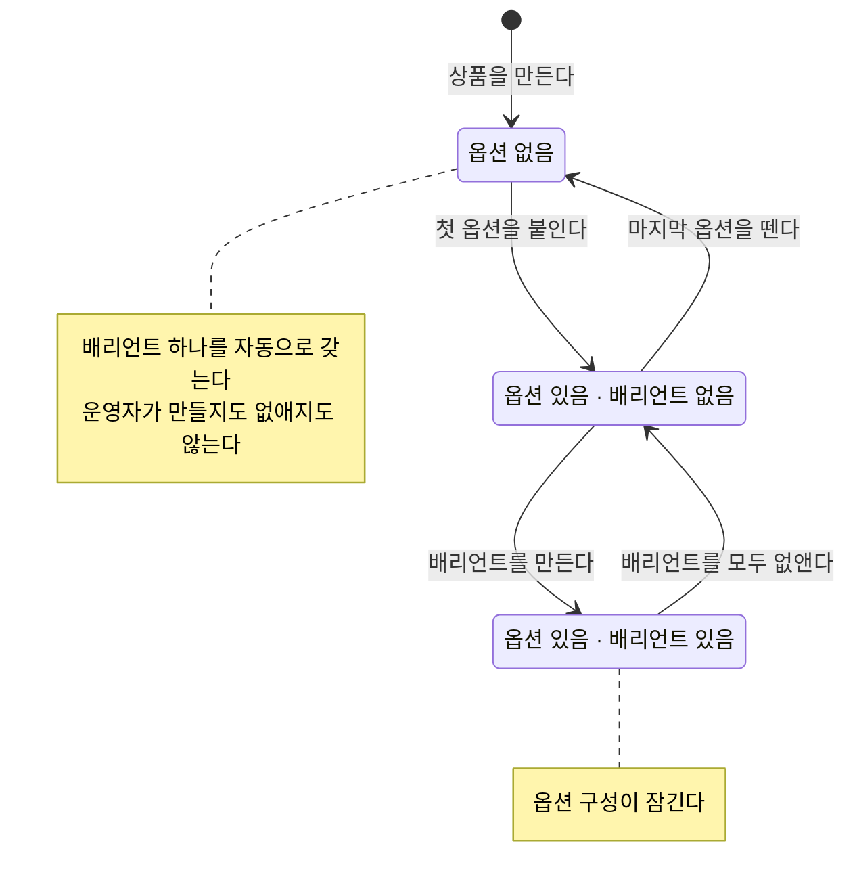

# 상품 등록과 수정

> 운영자가 파는 대상 하나를 만들고, 그 정보를 고치는 일.
>
> 여기 쓰인 말은 [용어](./glossary.md)를 따른다.

---

## 이 문서가 다루는 업무

팔 것이 생겼을 때 운영자가 상품을 만든다. 고객이 무엇을 기준으로 고르게 할지 정하고, 고르는 조합마다 실제로 팔릴 배리언트를 만들어 둔다. 이후 정보가 바뀌면 고친다.

## 흐름

**모든 상품은 언제나 팔 수 있는 상태여야 한다.** 고를 것이 없는 상품은 아무것도 고르지 않은 배리언트 하나로 팔리고, 고를 것이 있는 상품은 조합마다 배리언트를 갖는다. 배리언트가 하나도 없는 상품은 존재하지 않는다.

옵션을 처음 붙이면 자동으로 있던 배리언트가 사라지고, 마지막 옵션을 떼면 다시 생긴다. 운영자가 손댈 일은 없다.

**되돌아오는 배리언트는 나갔던 것과 다른 것이다.** 옵션을 붙였다 다시 모두 떼면 자동으로 생기는 배리언트는 새로 만들어진 것이고, 이전 것을 가리키던 하류는 그 자리를 잃는다. 옵션 구성을 오가는 일은 되돌리기가 아니다.

## 지원해야 하는 기능

### 상품 만들기

이름, 핸들, 설명, 그리고 어느 카테고리에 둘지를 받는다. 카테고리는 정하지 않아도 되지만, **없는 카테고리를 지목하면 상품을 만들 수 없다.** 오타나 이미 치워진 카테고리를 그 자리에서 알아채야 한다.

**핸들은 상품마다 달라야 한다.** 이미 쓰이고 있는 핸들로는 상품을 만들 수 없다. 보관된 상품도 자기 핸들을 계속 차지하고, 삭제된 상품의 핸들은 풀려서 다시 쓸 수 있다.

설명은 서식을 넣어 적는다. 쓸 수 있는 서식은 **글자 강조(굵게·기울임·밑줄·취소선), 문단과 줄바꿈, 목록, 제목**까지다. 링크와 이미지, 표는 넣을 수 없다.

허용한 범위 밖의 서식은 걷어내고 그 안의 글만 남긴다. 화면을 조작하거나 다른 곳을 불러오는 것이 설명에 섞여 들어오면, 그 설명을 그대로 내보이는 화면까지 함께 위험해진다.

서식을 걷어낸 글도 함께 보관되어, 목록이나 검색처럼 서식을 쓸 수 없는 자리에서 쓰인다.

만들어진 상품은 곧바로 배리언트 하나를 갖는다. 그 배리언트의 이름과 핸들은 상품의 것을 그대로 쓴다.

### 상품 정보 고치기

이름, 핸들, 설명, 속한 카테고리를 각각 따로 고칠 수 있다. 카테고리는 "정해지지 않음"으로도 되돌릴 수 있다.

핸들을 고칠 때도 이미 쓰이고 있는 핸들로는 바꿀 수 없고, 카테고리를 고칠 때도 없는 카테고리로는 바꿀 수 없다.

지금과 같은 값으로 고치면 아무 일도 일어나지 않는다. 고쳐졌다고 알리지도 않는다.

### 옵션 붙이기와 떼기

미리 만들어 둔 옵션을 골라 상품에 붙인다. 붙는 차례는 붙인 순서대로 매겨진다. 한 상품에 붙일 수 있는 옵션은 **20개**까지다.

| 막히는 경우 |
| --- |
| 이미 붙어 있는 옵션을 다시 붙일 때 |
| 붙어 있지 않은 옵션을 뗄 때 |
| 20개를 넘길 때 |
| 운영자가 만든 배리언트가 하나라도 있을 때 |

배리언트가 있는데 옵션 구성을 바꾸면, 이미 만들어 둔 조합이 무엇을 고른 결과였는지 알 수 없게 된다. 구성을 바꾸려면 배리언트를 먼저 걷어낸다. **옵션이 없는 상품이 자동으로 갖는 배리언트는 여기 세지 않는다.**

### 옵션 차례 바꾸기

붙어 있는 옵션의 차례를 다시 정한다. 붙어 있는 옵션 **전부를 빠짐없이, 한 번씩** 나열해야 한다. 일부만 적거나 같은 것을 두 번 적으면 막힌다.

차례만 바뀌고 조합은 그대로이므로, 배리언트가 있어도 차례는 바꿀 수 있다.

**이미 만들어 둔 배리언트가 고른 값들도 새 차례를 따라 다시 정렬된다.** 상품 안 어느 자리에서 보든 옵션 차례는 하나다.

### 배리언트 만들기와 없애기

붙어 있는 옵션마다 값을 하나씩 골라 배리언트를 만든다. 배리언트에도 이름과 핸들이 있고, 핸들은 **그 상품 안에서** 겹치지 않아야 한다. 한 상품이 가질 수 있는 배리언트는 **30개**까지다.

| 막히는 경우 |
| --- |
| 붙어 있는 옵션 중 값을 고르지 않은 것이 있을 때 |
| 한 옵션에 값을 둘 이상 고를 때 |
| 붙어 있지 않은 옵션의 값을 고를 때 |
| 같은 조합의 배리언트가 이미 있을 때 |
| 같은 핸들의 배리언트가 그 상품에 이미 있을 때 |
| 30개를 넘길 때 |
| 옵션이 없는 상품이 자동으로 갖는 배리언트를 없애려 할 때 |

**가능한 조합을 다 만들 필요는 없다.** 운영자는 실제로 파는 조합만 만든다. 고를 수 있는 값이 많아도 그중 일부 조합만 존재하는 것이 정상이다.

같은 조합인지는 고른 차례와 무관하게 본다. 고른 값들은 옵션이 붙은 차례대로 정렬되어 남는다.

배리언트의 이름과 핸들은 따로 고칠 수 있고, 배리언트 자체를 없앨 수도 있다. 고른 조합은 고치지 않는다. 조합을 바꾸려면 없애고 다시 만든다.

옵션이 없는 상품이 자동으로 갖는 배리언트는 다르다. 이름과 핸들이 상품의 것을 따라가므로 따로 고칠 수 없고, 상품의 이름이나 핸들이 바뀌면 함께 바뀐다.

## 파급

| 일어난 일 | 알려야 하는 것 |
| --- | --- |
| 상품이 만들어졌다 | 새 판매 대상이 생겼다는 사실. 이름·핸들·속한 카테고리를 함께 알린다 |
| 이름·핸들·설명이 바뀌었다 | 바뀐 값과 바뀌기 전 값 |
| 속한 카테고리가 바뀌었다 | 새 카테고리와 이전 카테고리 |
| 옵션이 붙거나 떨어졌다 | 어떤 옵션이 몇 번째에 붙었는지, 어떤 옵션이 떨어졌는지 |
| 옵션 차례가 바뀌었다 | 바뀐 뒤의 전체 차례 |
| 배리언트가 생기거나 사라졌다 | 어떤 조합의 배리언트인지 |
| 배리언트의 이름·핸들이 바뀌었다 | 바뀐 값과 바뀌기 전 값 |

옵션을 뗐을 때 뒤에 있던 옵션들의 차례가 앞으로 당겨지면, 그것은 **뗐다는 사실과 별개의 사실**이므로 차례가 바뀌었다고 따로 알린다.

자동으로 생기고 사라지는 배리언트도 **똑같이 알린다.** 하류는 배리언트 단위로 값과 수량을 매다는데, 그것이 생기고 사라진 사연이 운영자의 손인지 옵션 구성의 변화인지는 하류가 알 바가 아니다. 그래서 상품을 만들면 상품이 생겼다는 사실과 배리언트가 생겼다는 사실이 함께 나간다.

## 다루지 않는 것

- 보관과 삭제 → [정리](./retirement.md)
- 카테고리 자체를 만들고 옮기는 일 → [카테고리 체계 운영](./taxonomy-management.md)
- 붙일 옵션과 그 값을 미리 만들어 두는 일 → [옵션 정의](./option-catalog.md)
- 수량, 값, 진열 → [서비스 개요](./overview.md#무엇을-하지-않는가)
