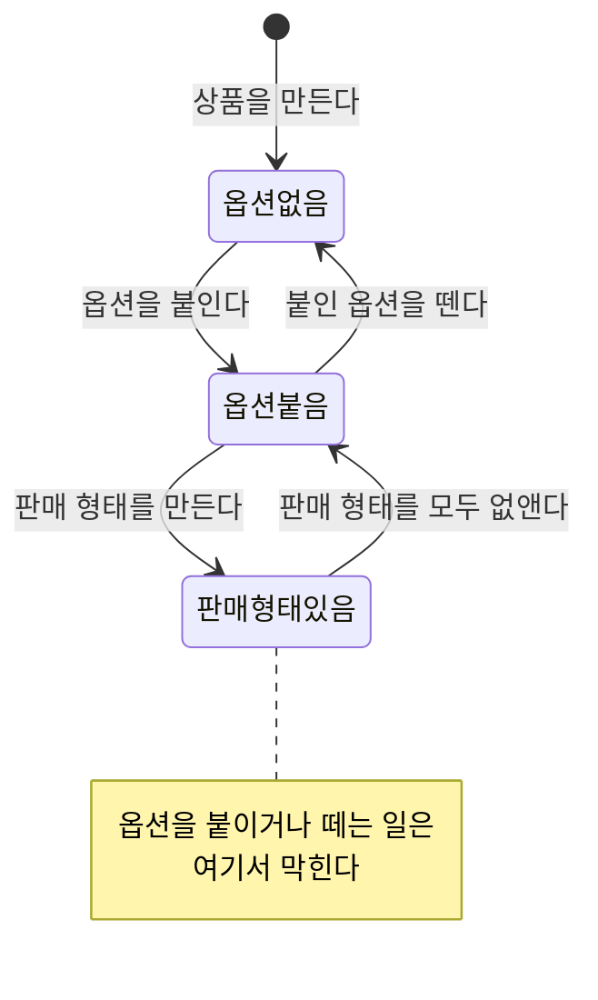

# 상품 등록과 수정

> 운영자가 파는 대상 하나를 만들고, 그 정보를 고치는 일.
>
> 여기 쓰인 말은 [용어](./glossary.md)를 따른다.

---

## 이 문서가 다루는 업무

팔 것이 생겼을 때 운영자가 상품을 만든다. 고객이 무엇을 기준으로 고르게 할지 정하고, 고르는 조합마다 실제로 팔릴 판매 형태를 만들어 둔다. 이후 정보가 바뀌면 고친다.

## 흐름

상품은 **틀을 먼저 세우고 안을 채우는 순서**로 만들어진다.

1. 상품을 만든다. 이름과 핸들과 설명을 적고, 어느 갈래에 둘지 고른다.
2. 고객이 무엇을 기준으로 고를지, 미리 만들어 둔 옵션을 골라 붙인다. 붙인 차례가 곧 고객에게 보이는 차례다.
3. 붙인 옵션마다 값을 하나씩 골라 판매 형태를 만든다.

판매 형태가 하나라도 있으면 옵션 구성을 바꿀 수 없다. 이미 만들어 둔 조합이 무엇을 고른 결과였는지 알 수 없게 되기 때문이다. 구성을 바꾸려면 판매 형태를 먼저 걷어낸다.

옵션이 하나도 붙지 않은 상품도 판매 형태를 가질 수 있다. 고를 것이 없는 상품은 아무것도 고르지 않은 형태 하나만 가진다.

## 지원해야 하는 기능

### 상품 만들기

이름, 핸들, 설명, 그리고 어느 갈래에 둘지를 받는다. 갈래는 정하지 않아도 된다.

설명은 서식을 넣어 적는다. 쓸 수 있는 서식은 **글자 강조(굵게·기울임·밑줄·취소선), 문단과 줄바꿈, 목록, 제목**까지다. 링크와 이미지, 표는 넣을 수 없다.

허용한 범위 밖의 서식은 걷어내고 그 안의 글만 남긴다. 화면을 조작하거나 다른 곳을 불러오는 것이 설명에 섞여 들어오면, 그 설명을 그대로 내보이는 화면까지 함께 위험해진다.

서식을 걷어낸 글도 함께 보관되어, 목록이나 검색처럼 서식을 쓸 수 없는 자리에서 쓰인다.

핸들은 상품마다 달라야 한다는 요구를 두지 않는다. 같은 핸들을 쓰는 상품이 여럿 있을 수 있다.

### 상품 정보 고치기

이름, 핸들, 설명, 속한 갈래를 각각 따로 고칠 수 있다. 갈래는 "정해지지 않음"으로도 되돌릴 수 있다.

지금과 같은 값으로 고치면 아무 일도 일어나지 않는다. 고쳐졌다고 알리지도 않는다.

### 옵션 붙이기와 떼기

미리 만들어 둔 옵션을 골라 상품에 붙인다. 붙는 차례는 붙인 순서대로 매겨진다.

| 막히는 경우 |
| --- |
| 이미 붙어 있는 옵션을 다시 붙일 때 |
| 붙일 수 있는 개수를 넘길 때 |
| 붙어 있지 않은 옵션을 뗄 때 |
| 판매 형태가 하나라도 있을 때 |

### 옵션 차례 바꾸기

붙어 있는 옵션의 차례를 다시 정한다. 붙어 있는 옵션 **전부를 빠짐없이, 한 번씩** 나열해야 한다. 일부만 적거나 같은 것을 두 번 적으면 막힌다.

차례만 바뀌고 조합은 그대로이므로, 판매 형태가 있어도 차례는 바꿀 수 있다.

### 판매 형태 만들기와 없애기

붙어 있는 옵션마다 값을 하나씩 골라 판매 형태를 만든다. 판매 형태에도 이름과 핸들이 있다.

| 막히는 경우 |
| --- |
| 붙어 있는 옵션 중 값을 고르지 않은 것이 있을 때 |
| 한 옵션에 값을 둘 이상 고를 때 |
| 붙어 있지 않은 옵션의 값을 고를 때 |
| 같은 조합의 판매 형태가 이미 있을 때 |
| 만들 수 있는 개수를 넘길 때 |

같은 조합인지는 고른 차례와 무관하게 본다. 고른 값들은 옵션이 붙은 차례대로 정렬되어 남는다.

판매 형태의 이름과 핸들은 따로 고칠 수 있고, 판매 형태 자체를 없앨 수도 있다. 고른 조합은 고치지 않는다. 조합을 바꾸려면 없애고 다시 만든다.

## 파급

| 일어난 일 | 알려야 하는 것 |
| --- | --- |
| 상품이 만들어졌다 | 새 판매 대상이 생겼다는 사실. 이름·핸들·속한 갈래를 함께 알린다 |
| 이름·핸들·설명이 바뀌었다 | 바뀐 값과 바뀌기 전 값 |
| 속한 갈래가 바뀌었다 | 새 갈래와 이전 갈래 |
| 옵션이 붙거나 떨어졌다 | 어떤 옵션이 몇 번째에 붙었는지, 어떤 옵션이 떨어졌는지 |
| 옵션 차례가 바뀌었다 | 바뀐 뒤의 전체 차례 |
| 판매 형태가 생기거나 사라졌다 | 어떤 조합의 형태인지 |
| 판매 형태의 이름·핸들이 바뀌었다 | 바뀐 값과 바뀌기 전 값 |

옵션을 뗐을 때 뒤에 있던 옵션들의 차례가 앞으로 당겨지면, 그것은 **뗐다는 사실과 별개의 사실**이므로 차례가 바뀌었다고 따로 알린다.

## 다루지 않는 것

- 보관과 파기 → [정리](./retirement.md)
- 갈래 자체를 만들고 옮기는 일 → [분류 체계 운영](./taxonomy-management.md)
- 붙일 옵션과 그 값을 미리 만들어 두는 일 → [옵션 정의](./option-catalog.md)
- 수량, 값, 진열 → [서비스 개요](./overview.md#무엇을-하지-않는가)
