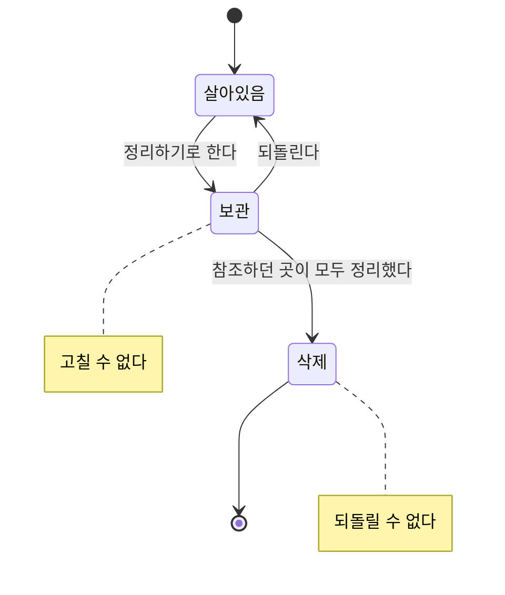

# 정리

> 운영자가 더 이상 쓰지 않는 상품·카테고리·옵션을 정리하는 일.
>
> 여기 쓰인 말은 [용어](./glossary.md)를 따른다.

---

## 이 문서가 다루는 업무

파는 대상이 늘 늘어나기만 하지는 않는다. 단종된 상품, 쓰지 않게 된 카테고리, 더 이상 고르게 하지 않을 옵션을 운영자가 정리한다.

정리하는 일은 **한 번에 끝나지 않는다.** 이 서비스가 정한 대상을 다른 서비스들이 가져다 쓰고 있고, 그쪽이 아직 그것을 가리키고 있는 동안 없애 버리면 가리키던 곳이 빈 자리를 보게 된다.

## 흐름

**보관**은 운영자의 뜻을 밝히는 단계다. 더 이상 쓰지 않기로 했다는 사실이 알려지고, 그것을 받은 다른 서비스들이 각자 정리를 시작한다. 잘못 정리했다면 여기서 되돌릴 수 있다.

**삭제**는 정리가 끝난 뒤에 밟는다. 보관을 거치지 않고 바로 삭제할 수는 없고, 삭제한 뒤에는 되돌릴 수 없다.

## 지원해야 하는 기능

### 보관하기

이미 보관된 것을 다시 보관해도 아무 일도 일어나지 않는다.

보관된 것은 고칠 수 없다. 이름도 구성도 바꾸지 못한다. 정리하기로 한 것을 계속 손보는 일은 정리를 끝나지 않게 만든다.

한 가지만 예외다. 보관된 카테고리의 [카테고리 경로](./taxonomy-management.md#흐름)는 조상이 움직이면 따라 바뀐다. 그것은 그 카테고리를 손보는 일이 아니라, 바뀐 자리를 그대로 읽는 일이다.

**카테고리는 하위 카테고리까지 함께 보관된다.** 나가는 카테고리 밑에 살아 있는 카테고리를 남겨 두면, 아무 상품도 묶지 않는 부모에 매달린 카테고리가 생긴다.

### 되돌리기

보관을 물러 다시 살아 있는 상태로 만든다. 삭제된 것은 되돌릴 수 없다.

**카테고리는 자기 것만 풀린다.** 보관은 하위까지 적용되지만 되돌리기는 그렇지 않다. 어디까지 되살릴지는 그때의 판단이고, 보관할 때의 상황이 그대로일 것이라 볼 수 없기 때문이다.

| 막히는 경우 |
| --- |
| 이미 삭제됐을 때 |
| 부모 카테고리가 아직 보관 상태일 때 |

부모가 보관 상태인데 자식만 되살리면, 나가기로 한 카테고리 밑에 살아 있는 카테고리가 매달린다. 보관할 때 막았던 상태가 되돌리는 길로 다시 생기는 셈이다. 하위 카테고리를 되살리려면 **위에서 아래로 하나씩** 푼다.

### 삭제하기

| 막히는 경우 |
| --- |
| 보관을 거치지 않았을 때 |
| 이미 삭제됐을 때 |
| 카테고리에 아직 하위 카테고리가 남아 있을 때 |
| 옵션을 아직 어떤 상품이 붙이고 있을 때 |

삭제는 보관과 반대로 **하나씩** 이뤄진다. 보관이 운영자의 뜻이라 한 번에 하위까지 적용되는 반면, 삭제는 가리키던 곳이 실제로 참조를 정리했는지 확인한 결과이고 그 확인은 대상마다 따로 끝난다. 카테고리는 아래에서 위로, 최하위 카테고리부터 없어진다.

삭제된 것은 어떤 요청도 받지 않는다.

## 삭제가 남기는 자리

삭제는 그것을 가리키던 것들에 빈 자리를 남긴다. 대상마다 그 자리를 다르게 정리한다.

| 삭제된 것 | 남는 자리를 어떻게 하는가 |
| --- | --- |
| 카테고리 | 그 카테고리에 속해 있던 상품이 **카테고리 없음**이 된다. 보관 기간이 운영자에게 상품을 옮길 유예다 |
| 상품 | 쓰던 핸들이 풀려 다른 상품이 가져갈 수 있게 된다 |
| 옵션 | 남는 자리가 없다. 쓰는 상품이 있으면 애초에 삭제되지 않는다 |

## 파급

| 일어난 일 | 알려야 하는 것 |
| --- | --- |
| 보관됐다 | 무엇이 나갈 예정인지. 받은 쪽은 정리를 시작한다 |
| 되돌려졌다 | 무엇이 다시 살아났는지. 받은 쪽은 정리를 멈춘다 |
| 삭제됐다 | 무엇이 없어졌는지 |

세 단계가 각각 따로 알려지는 것이 이 방식의 핵심이다. 한 번만 알리면 받는 쪽에 정리할 틈도, 되돌릴 틈도 없다.

## 다루지 않는 것

- 살아 있는 대상을 고치는 일 → [상품 등록과 수정](./product-authoring.md) · [카테고리 체계 운영](./taxonomy-management.md) · [옵션 정의](./option-catalog.md)
- 핸들이 언제 비어 있다고 보는지 → [상품 만들기](./product-authoring.md#상품-만들기)
- 쓰이고 있는 옵션 값을 없앨 수 없는 이유 → [값 더하기, 이름 고치기, 없애기](./option-catalog.md#값-더하기-이름-고치기-없애기)
- 알림이 다른 서비스에 어떤 방식으로 전달되는지 → [메시징](../architectures/messaging.md)
