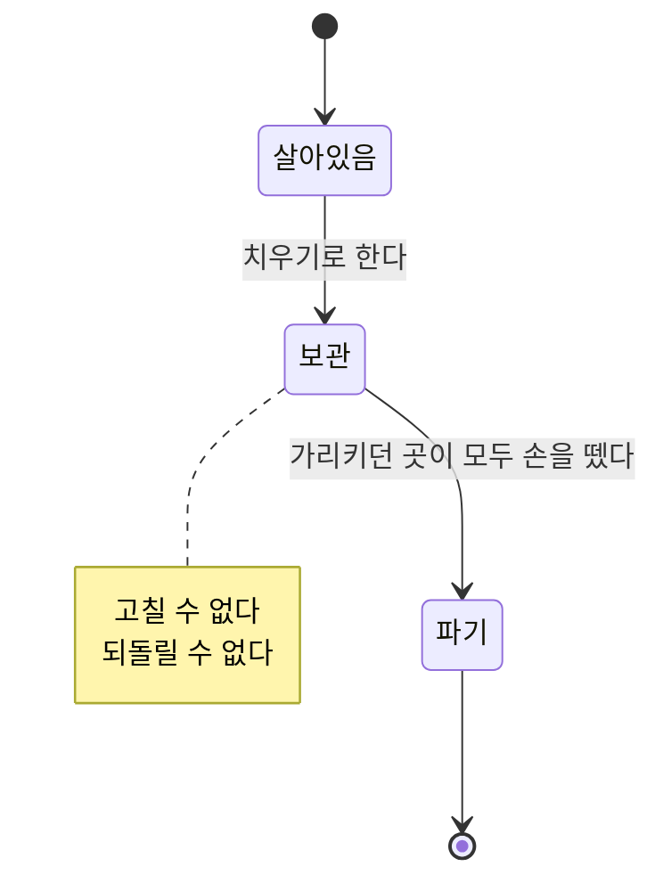

# 정리

> 운영자가 더 이상 쓰지 않는 상품·분류·옵션을 치우는 일.
>
> 여기 쓰인 말은 [용어](./glossary.md)를 따른다.

---

## 이 문서가 다루는 업무

파는 대상이 늘 늘어나기만 하지는 않는다. 단종된 상품, 쓰지 않게 된 갈래, 더 이상 고르게 하지 않을 옵션을 운영자가 치운다.

치우는 일은 **한 번에 끝나지 않는다.** 이 서비스가 정한 대상을 다른 서비스들이 가져다 쓰고 있고, 그쪽이 아직 그것을 가리키고 있는 동안 없애 버리면 가리키던 곳이 빈 자리를 보게 된다.

## 흐름

**보관**은 운영자의 뜻을 밝히는 단계다. 더 이상 쓰지 않기로 했다는 사실이 알려지고, 그것을 받은 다른 서비스들이 각자 정리를 시작한다.

**파기**는 정리가 끝난 뒤에 밟는다. 보관을 거치지 않고 바로 파기할 수는 없다.

## 지원해야 하는 기능

### 보관하기

이미 보관된 것을 다시 보관해도 아무 일도 일어나지 않는다.

보관된 것은 고칠 수 없다. 이름도 구성도 바꾸지 못한다. 치우기로 한 것을 계속 손보는 일은 정리를 끝나지 않게 만든다.

**분류는 아래 갈래까지 함께 보관된다.** 나가는 갈래 밑에 살아 있는 갈래를 남겨 두면, 아무것도 분류하지 않는 부모에 매달린 갈래가 생긴다.

### 파기하기

| 막히는 경우 |
| --- |
| 보관을 거치지 않았을 때 |
| 이미 파기됐을 때 |
| 분류에 아직 아래 갈래가 남아 있을 때 |

파기는 보관과 반대로 **하나씩** 이뤄진다. 보관이 운영자의 뜻이라 한 번에 번지는 반면, 파기는 가리키던 곳이 실제로 손을 뗐는지 확인한 결과이고 그 확인은 대상마다 따로 끝난다. 분류는 아래에서 위로, 잎에 해당하는 갈래부터 없어진다.

파기된 것은 어떤 요청도 받지 않는다.

## 파급

| 일어난 일 | 알려야 하는 것 |
| --- | --- |
| 보관됐다 | 무엇이 나갈 예정인지. 받은 쪽은 정리를 시작한다 |
| 파기됐다 | 무엇이 없어졌는지 |

두 단계가 각각 따로 알려지는 것이 이 방식의 핵심이다. 한 번만 알리면 받는 쪽에 정리할 틈이 없다.

## 다루지 않는 것

- 살아 있는 대상을 고치는 일 → [상품 등록과 수정](./product-authoring.md) · [분류 체계 운영](./taxonomy-management.md) · [옵션 정의](./option-catalog.md)
- 알림이 다른 서비스에 어떤 방식으로 전달되는지 → [메시징](../architectures/messaging.md)
