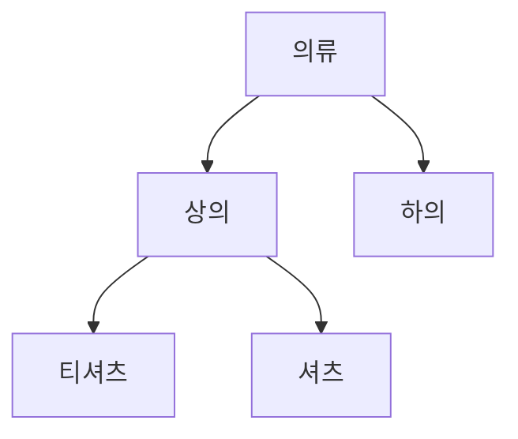

# 분류 체계 운영

> 운영자가 상품을 묶는 갈래를 만들고, 이름을 고치고, 자리를 옮기는 일.
>
> 여기 쓰인 말은 [용어](./glossary.md)를 따른다.

---

## 이 문서가 다루는 업무

상품이 늘어나면 묶어서 봐야 한다. 운영자는 갈래를 만들어 나무 모양의 체계를 세우고, 체계가 실제 판매 구성과 어긋나면 갈래의 이름을 고치거나 자리를 옮긴다.

## 흐름

갈래는 뿌리에서 시작해 아래로 뻗는다. 갈래마다 **분류 경로**가 함께 유지되어, 그 갈래가 어디에 속한 무엇인지를 한 줄로 읽을 수 있다.

위 그림에서 티셔츠의 분류 경로는 뿌리에서 자기까지의 이름을 차례로 이어 붙인 것이다. 갈래의 이름이 바뀌거나 자리가 옮겨지면 **그 아래 모든 갈래의 경로가 함께 다시 쓰인다.**

## 지원해야 하는 기능

### 갈래 만들기

이름과 어느 갈래 밑에 둘지를 받는다. 밑에 두지 않으면 뿌리 갈래가 된다.

| 막히는 경우 |
| --- |
| 같은 부모 밑에 같은 이름의 갈래가 이미 있을 때 |
| 이름에 경로를 잇는 표기가 들어 있을 때 |
| 부모로 지목한 갈래가 없을 때 |

경로는 갈래 이름을 이어 붙여 만들기 때문에, 이름 자체에 잇는 표기가 들어가면 어디까지가 한 갈래인지 읽을 수 없게 된다.

### 이름 고치기

같은 부모 밑에서 이름이 겹치지 않아야 한다는 조건은 만들 때와 같다.

### 자리 옮기기

다른 갈래 밑으로 옮기거나, 뿌리로 끌어올린다.

| 막히는 경우 |
| --- |
| 자기 자신 밑으로 옮길 때 |
| 자기 아래에 있는 갈래 밑으로 옮길 때 |
| 옮겨 갈 자리에 같은 이름의 갈래가 이미 있을 때 |

자기 아래로 옮기면 나무가 자기 자신에게 되감겨 뿌리가 없어진다.

## 파급

| 일어난 일 | 알려야 하는 것 |
| --- | --- |
| 갈래가 만들어졌다 | 이름, 부모, 분류 경로 |
| 이름이 바뀌었다 | 바뀐 이름과 경로, 그리고 바뀌기 전의 것 |
| 자리가 옮겨졌다 | 새 부모와 이전 부모, 바뀐 경로와 이전 경로 |
| 아래 갈래의 경로가 다시 쓰였다 | 갈래마다 바뀐 경로와 이전 경로 |

아래 갈래의 경로가 다시 쓰이는 것은 **이름이 바뀐 것과 다른 사실**이다. 자기 이름은 그대로인데 놓인 자리를 읽는 방식만 바뀐 것이므로 따로 알린다.

경로를 다시 쓰는 일은 이름을 고치거나 자리를 옮긴 것과 **같은 순간에 끝난다.** 잠깐이라도 위아래의 경로가 어긋나 보이는 구간을 두지 않는다.

## 다루지 않는 것

- 갈래를 치우는 일 → [정리](./retirement.md)
- 상품을 어느 갈래에 둘지 → [상품 등록과 수정](./product-authoring.md#상품-정보-고치기)
